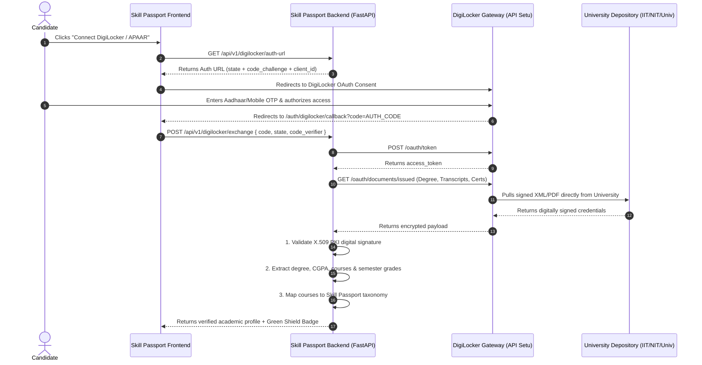

# 🇮🇳 Skill Passport — DigiLocker & National Academic Depository (NAD) Integration

**Document Version:** 1.0.0  
**Project:** Skill Passport (Verifiable Skill & Career Match Engine)  
**Document Type:** Technical Implementation Guide & Benefits Whitepaper  
**Prepared For:** Engineering Team, Product Managers & Stakeholders  

---

## 📌 1. Executive Summary

### The Core Problem
In the modern hiring ecosystem, resumes and candidate profiles suffer from **unverified credentials**:
1. **High Background Verification (BGV) Latency & Cost**: Recruiters spend **2 to 4 weeks** and **₹1,500 – ₹5,000 per candidate** on third-party verification agencies to manually confirm university degrees, roll numbers, and passing marks.
2. **Credential & Degree Fraud**: Self-reported CGPAs, fabricated diplomas, and modified PDF transcripts cannot be instantly disproven by automated matching engines.
3. **Coarse-Grained Skill Evidence**: Standard college degrees (e.g. *B.Tech CSE*) don't reveal course-level mastery (e.g. *Algorithms Grade A+*, *Distributed Systems 95%*, *NPTEL Cloud Computing Elite*).

### The Solution: DigiLocker & NAD Integration
Integrating **DigiLocker** (under MeitY) and the **National Academic Depository (NAD)** via **API Setu** enables Skill Passport to **cryptographically pull and verify official academic records directly from accredited universities and boards** (UGC, AICTE, IITs, NITs, Central/State Universities, CBSE, NPTEL, and SWAYAM).

```
┌─────────────────────────┐       OAuth 2.0 Consent       ┌─────────────────────────┐
│     Skill Passport      │ ◄───────────────────────────► │  DigiLocker / NAD /     │
│   Verifiable Engine     │                               │      APAAR Portal       │
└────────────┬────────────┘                               └────────────┬────────────┘
             │                                                         │
             │ Pulls XML / PKI Signed Doc                              │
             ▼                                                         │
┌────────────────────────────────────────────────────────┐             │
│  Cryptographic Signature Verification (Govt X.509 PKI)  │ ◄───────────┘
└────────────────────────────┬───────────────────────────┘
                             ▼
┌────────────────────────────────────────────────────────┐
│  Automated Course-to-Skill Parsing & Verification Rank │
└────────────────────────────────────────────────────────┘
```

---

## 🌟 2. Detailed Stakeholder Benefits

### 🎓 A. For Students & Candidates
* **1-Click Instant Sync**: No manual scanning, uploading, or typing degree names, passing years, roll numbers, or CGPAs.
* **100% Tamper-Proof Trust**: Academic credentials issued directly from accredited institutions carry official government digital signatures (X.509 PKI).
* **Instant Verification Score Boost**: Coursework and subjects extracted from transcripts directly boost the candidate's **Verification Ratio** in the Skill Passport engine.
* **Permanent Mobility via APAAR / ABC**: Even if candidates switch email accounts or resumes, their DigiLocker-linked **Automated Permanent Academic Account Registry (APAAR ID)** permanently anchors their verified credentials.

### 🏢 B. For Recruiters & Enterprise Hiring
* **Instant Background Verification (BGV)**: Reduces verification turnaround from **2–3 weeks to 0 seconds**.
* **Zero Cost**: Eliminates expensive manual third-party BGV checks.
* **Zero Degree Fraud**: Eliminates fake universities, edited PDF transcripts, or forged marksheets.
* **Transcript-Level Rigor**: Recruiters can review verified course-by-course grades and university accreditation status with 1-click.

### 🚀 C. For the Skill Passport Platform
* **Institutional Market Leadership**: Skill Passport becomes one of the first next-gen match engines to integrate National Academic Depository (NAD) and APAAR.
* **High-Fit Match Accuracy**: Match algorithms gain high-fidelity signals (verified courses + real grades + GitHub repositories + LinkedIn evidence).

---

## 📊 3. Comparison Matrix: Before vs. After DigiLocker

| Dimension | Traditional System (Without DigiLocker) | Skill Passport (With DigiLocker) |
| :--- | :--- | :--- |
| **Verification Authority** | Unverified / Self-attested PDF uploads | **Cryptographically signed by Govt & Universities** |
| **Recruiter BGV Time** | 2 to 4 weeks (background verification agencies) | **Instantaneous (0 seconds)** |
| **Recruiter Cost** | ₹1,500 – ₹5,000 per candidate hire | **₹0 (Free / Open API standard)** |
| **Credential Fraud Risk** | High (edited PDFs, fake universities) | **0% Fraud Risk (Direct from University Registrars)** |
| **Course-Level Insights** | Rarely accessible / manual entry | **Automatic Subject-by-Subject Skill Extraction** |
| **Candidate Trust Score** | Subjective / Unproven | **100% Guaranteed Verifiable Evidence** |

---

## 📋 4. Supported Academic Document Types & Skill Mapping

| Document Type | Issuing Authority | Key Data Fields Extracted | Mapped Skill / Passport Evidence |
| :--- | :--- | :--- | :--- |
| **University Degree** | UGC / AICTE Recognized Universities | Degree Name, Major, Passing Year, Roll No, Institute | Core Education Level (e.g. *B.Tech Computer Science*) |
| **Semester Marksheet / Transcript** | NAD / Autonomous Colleges | Course Names, Semester Grades, Credit Scores | Domain Skills (e.g. *Distributed Systems*, *Algorithms*) |
| **NPTEL / SWAYAM Certs** | IITs / Ministry of Education | Course Name, Score %, Elite/Gold Certificate | Specific Technical Competencies (e.g. *Python*, *Deep Learning*) |
| **Class XII Marksheet** | CBSE / CISCE / State Boards | Mathematics & Computer Science scores | Foundational STEM Proficiency |
| **Skill India Certificates** | NSDC / Sector Skill Councils | Trade/Skill Competency Certification | Practical & Applied Technical Skills |

---

## 🏗️ 5. Technical Implementation Blueprint

### A. Authentication & Sequence Flow

DigiLocker integrates with Skill Passport via **API Setu** using **OAuth 2.0 with PKCE (Proof Key for Code Exchange)**:



---

### B. Database Schema Design (`app/models/academic_credential.py`)

```python
import uuid
from datetime import datetime
from sqlalchemy import Column, String, Integer, Boolean, DateTime, ForeignKey
from sqlalchemy.dialects.postgresql import UUID, JSONB
from app.core.database import Base

class CandidateAcademicCredential(Base):
    __tablename__ = "candidate_academic_credentials"

    id = Column(UUID(as_uuid=True), primary_key=True, default=uuid.uuid4)
    user_id = Column(UUID(as_uuid=True), ForeignKey("users.id", ondelete="CASCADE"), nullable=False)
    
    # DigiLocker / NAD metadata
    doc_uri = Column(String(255), unique=True, nullable=False) # e.g. "in.gov.digilocker.du.degree.12345"
    issuer_id = Column(String(100), nullable=False) # e.g. "in.gov.du" (Delhi University)
    issuer_name = Column(String(255), nullable=False) # e.g. "University of Delhi"
    doc_type = Column(String(50), nullable=False) # "degree", "transcript", "certificate"
    
    # Extracted academic details
    degree_name = Column(String(255), nullable=True) # e.g. "Bachelor of Technology"
    specialization = Column(String(255), nullable=True) # e.g. "Computer Science & Engineering"
    roll_number = Column(String(100), nullable=True)
    graduation_year = Column(Integer, nullable=True)
    cgpa_or_grade = Column(String(50), nullable=True) # e.g. "8.9 / 10.0"
    
    # Parsed accredited courses (used to feed Skill Passport match algorithms)
    courses_extracted = Column(JSONB, default=list) # [{"course": "Operating Systems", "grade": "A+"}]
    
    # Cryptographic proof status
    pki_verified = Column(Boolean, default=True)
    certificate_thumbprint = Column(String(255), nullable=True)
    
    created_at = Column(DateTime(timezone=True), default=datetime.utcnow)
```

---

### C. Backend Service Implementation (`app/services/digilocker_service.py`)

```python
import httpx
import xml.etree.ElementTree as ET
from app.core.config import settings

class DigiLockerService:
    BASE_URL = "https://digilocker.meripehchaan.gov.in/public/oauth2/1"

    @classmethod
    def get_authorization_url(cls, state: str, code_challenge: str) -> str:
        """Constructs secure DigiLocker OAuth consent redirect URL."""
        return (
            f"{cls.BASE_URL}/authorize?"
            f"response_type=code&"
            f"client_id={settings.DIGILOCKER_CLIENT_ID}&"
            f"redirect_uri={settings.DIGILOCKER_REDIRECT_URI}&"
            f"state={state}&"
            f"code_challenge={code_challenge}&"
            f"code_challenge_method=S256&"
            f"scope=academic"
        )

    @classmethod
    async def exchange_token(cls, code: str, code_verifier: str) -> dict:
        """Exchanges auth code for DigiLocker bearer access token."""
        async with httpx.AsyncClient() as client:
            resp = await client.post(
                f"{cls.BASE_URL}/token",
                data={
                    "grant_type": "authorization_code",
                    "code": code,
                    "client_id": settings.DIGILOCKER_CLIENT_ID,
                    "client_secret": settings.DIGILOCKER_CLIENT_SECRET,
                    "redirect_uri": settings.DIGILOCKER_REDIRECT_URI,
                    "code_verifier": code_verifier,
                },
            )
            resp.raise_for_status()
            return resp.json()

    @classmethod
    async def fetch_issued_academic_docs(cls, access_token: str) -> list[dict]:
        """Pulls university degrees, marksheets and NPTEL certs."""
        async with httpx.AsyncClient() as client:
            headers = {"Authorization": f"Bearer {access_token}"}
            resp = await client.get(f"{cls.BASE_URL}/xml/issued", headers=headers)
            resp.raise_for_status()
            return cls._parse_and_verify_xml(resp.text)

    @classmethod
    def _parse_and_verify_xml(cls, xml_data: str) -> list[dict]:
        """Parses PKI-signed XML, verifies university signatures, and extracts coursework."""
        root = ET.fromstring(xml_data)
        # Extract student degree, university name, semester courses, and grade points
        ...
```

---

### D. Automated Coursework-to-Skill Taxonomy Mapping

When a student imports their transcript:
* **`"CS-301: Distributed Computing & Cloud Infrastructure"`** *(Grade A)* ➡️ **`Distributed Systems`**, **`Cloud Computing`** *(100% Verifiable Evidence)*.
* **`"CS-201: Data Structures & Algorithms"`** *(Grade A+)* ➡️ **`Algorithms`**, **`Data Structures`** *(100% Verifiable Evidence)*.
* **`"NPTEL: Deep Learning for Computer Vision"`** *(Score 88%)* ➡️ **`Deep Learning`**, **`Computer Vision`**, **`PyTorch`** *(100% Verifiable Evidence)*.

These extracted courses directly inject into the candidate's **Evidence Lifecycle**, raising their **Verification Score** from 25% to 85%+.

---

## 🎨 6. Frontend UI Components

### A. "Connect DigiLocker" Action Card (Evidence Upload Tab)
```tsx
<div className="rounded-2xl border border-emerald-500/20 bg-emerald-950/20 p-5">
  <div className="flex items-center justify-between">
    <div className="flex items-center gap-3">
      <ShieldCheck className="h-7 w-7 text-emerald-400" />
      <div>
        <h4 className="font-bold text-sm text-slate-100">National Academic Depository (NAD / DigiLocker)</h4>
        <p className="text-xs text-slate-400">Import university degrees, transcripts, and official GPA directly.</p>
      </div>
    </div>
    <button 
      onClick={handleConnectDigiLocker}
      className="rounded-xl bg-emerald-600 hover:bg-emerald-500 px-4 py-2 text-xs font-bold text-white shadow-lg"
    >
      Connect DigiLocker
    </button>
  </div>
</div>
```

### B. Recruiter View Verification Modal
When recruiters view candidate profiles:
* A prominent **"🇮🇳 DigiLocker & University Verified"** green shield badge is displayed.
* Clicking the badge opens a **Proof Verification Modal** containing the issuing university name, year of passing, official degree ID, and cryptographic timestamp without exposing sensitive government IDs (Aadhaar is never stored or displayed).

---

## 🔒 7. Privacy, Security & Legal Compliance (DPDP Act 2023)

1. **User-Controlled Consent**: Candidates select which documents to import (degrees, transcripts, or certifications).
2. **Data Minimization**: Only academic degrees, universities, and coursework are saved. Government numbers (such as Aadhaar) are masked or discarded after verification.
3. **Revocation**: Candidates can unlink DigiLocker and remove their cached academic proofs at any time.

---

## 🚀 8. Engineering Implementation Milestones

1. **Milestone 1**: Sandbox registration on **API Setu (apisetu.gov.in)**.
2. **Milestone 2**: Backend OAuth handler & `digilocker_service.py`.
3. **Milestone 3**: XML digital signature parser & Course-to-Skill taxonomy mapper.
4. **Milestone 4**: Frontend "Connect DigiLocker" UI card & Recruiter Verification Modal.

---

*This document is ready to be shared, committed, or presented to your team.*
